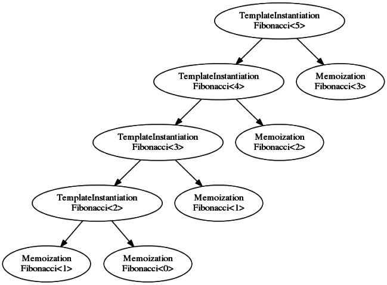
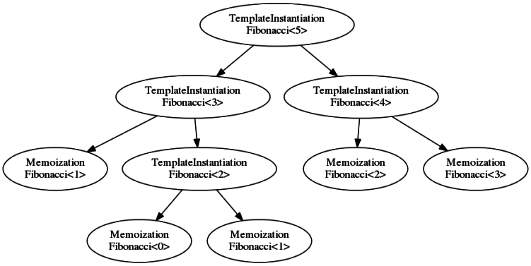
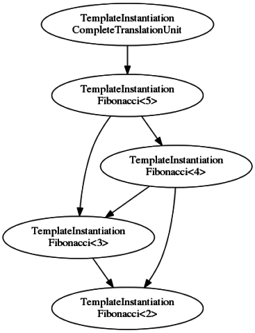
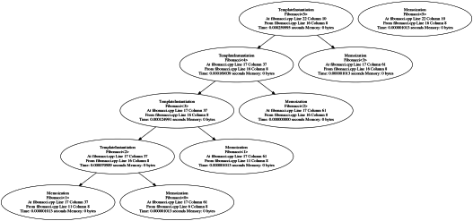
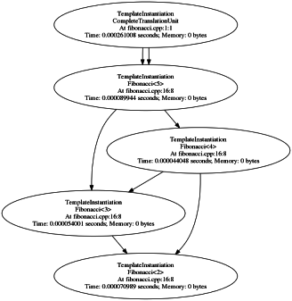
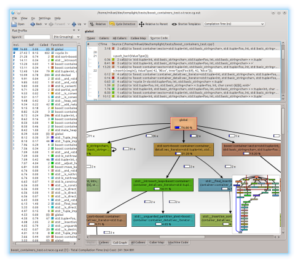

# Templight Tools - Supporting Tools for the Templight Profiler

Templight is a Clang-based tool to profile the time and memory consumption of template instantiations to gain introspection into the template instantiation process. The tools included in this package provide additional facilities to process the profiling data.

## Table of Contents

- [Templight Profiler](#templight-profiler)
- [Getting Started](#getting-started)
 - [Getting and Compiling Templight](#getting-and-compiling-templight)
- [Using the Templight Profiler](#using-the-templight-profiler)
- [Converting the Output Format](#converting-the-output-format)
 - [Template Instantiation Tree vs. Meta-Call-Graph](#template-instantiation-tree-vs-meta-call-graph)
- [Using Blacklists](#using-blacklists)
- [Inspecting the profiles](#inspecting-the-profiles)
 - [Visualizing with GraphViz](#visualizing-with-graphviz)
 - [Inspecting with KCacheGrind](#inspecting-with-kcachegrind)
- [Wish List](#wish-list)
- [License](#license)

## Templight Profiler

The templight profiler is intended to be used as a drop-in substitute for the clang compiler (or one of its variants, like clang-cl) and it performs a full compilation, *honoring all the clang compiler options*, but records a trace (or history) of the template instantiations performed by the compiler for each translation unit.

The templight profiler is built as a clang-based tool, which must be compiled against the LLVM / Clang source code directly (with a patch provided). The project is maintained under a separate repository which can be found here:

https://github.com/mikael-s-persson/templight

Complete instructions are provided in that repository on how to build the templight profiler and how to use it. Only brief parts of these instructions are repeated here.

## Getting Started

### Getting and Compiling Templight-Tools

Templight-Tools can be compiled from source, given that dependencies are met.

Requirements:
 - Boost libraries: program-options, filesystem, test, and graph. Almost any reasonably recent version should work (configured to require 1.48.1 and above, but the newer the better).
 - Requires a compiler with good C++11 support (Visual Studio >= 2013, GCC >= 4.8, Clang >= 3.5).

1. Clone the templight-tools repository, as follows:
```bash
  (from desired folder)
  $ mkdir templight-tools
  $ git clone <link-to-clone-templight-tools-github-repo> templight-tools
```

2. Configure and compile with cmake / make:
```bash
  (from desired folder)
  $ cd templight-tools
  $ mkdir build
  $ cd build
  $ cmake ..
  $ make
```

3. If successful, there should be templight-tools executables in the `build/bin` folder.

*Note*: It can sometimes happen that cmake fails to locate the Boost installation. If that happens, you can define the cmake variable `CUSTOM_BOOST_PATH` to wherever you have installed Boost. For example, if Boost is installed in `/usr/local` (meaning that Boost headers are in `/usr/local/include/boost/` and libraries are in `/usr/local/lib/`), then you would invoke cmake as `$ cmake -DCUSTOM_BOOST_PATH:PATH=/usr/local ..`. Similarly, under Windows (where it is more likely that cmake fails to find Boost), if you have boost under `C:\boost` (i.e., headers are in `C:\boost\include\boost`), then you can set `CUSTOM_BOOST_PATH` to `C:\boost`.

## Using the Templight Profiler

The templight profiler is invoked by following the [instructions on the templight page](https://github.com/mikael-s-persson/templight#using-the-templight-profiler). By default, the templight profiler will output in a protobuf format (with the extension `.trace.pbf` or `.memory.trace.pbf`, depending on whether memory profiling is enabled or not). **This the only format that templight-tools programs understand.** The reason is because this format is the smallest, fastest and easiest to parse for the tools. It's possible that some additional formats will be supported in the future, but there are no plans for it at the moment.

The instructions for the templight profiler recommend the use of filtering options such as `-ignore-system` and `-blacklist` to minimize the uninteresting "noise" in the profiles. However, for some analysis tools, it might be preferrable to keep as much information in the profiles as possible (not using the filtering options). Moreover, the `-blacklist` option is also available in templight-tools programs, which allows the filtering to be done after analysis.

## Converting the Output Format

Templight outputs its traces to a Google protocol buffer output format to minimize the size of the files and the time necessary to produce and load the trace files. For convenience, however, a conversion tool is provided, `templight-convert`, to produce other output formats that may be more convenient for third-party applications. Currently, `templight-convert` provides the following output formats:

 - "protobuf": Output in a Google protocol buffer format, which is an efficient binary extensible format. The message definition file is provided in the templight repository, as `templight_message.proto`, so that off-the-shelf protobuf software can be used to read the trace files. The format uses some dictionary-based compression to minimize it's size, therefore, additional steps are necessary to reconstruct the file names and template names (as explained in [this wiki page](https://github.com/mikael-s-persson/templight/wiki/Protobuf-Template-Name-Compression---Explained)).
 - "xml": An XML format, the well-known text-based markup language.
 - "text": A simple text file, mostly for human-readability.
 - "nestedxml": An XML format with nested template instantiations instead of a flat begin-end structure (used with "xml"). This option renders a template instantiation tree (see explanation below).
 - "graphml": A standard XML-like graph markup language, supported by many graph vizualization software. This option renders a template instantiation tree (see explanation below).
 - "graphviz": A graph vizualization format, supported by the popular graphviz library and "dot" utility program for rendering diagrams. This option renders a template instantiation tree (see explanation below).
 - "graphml-cg": A standard XML-like graph markup language, supported by many graph vizualization software. This option renders a meta-call-graph (see explanation below).
 - "graphviz-cg": A graph vizualization format, supported by the popular graphviz library and "dot" utility program for rendering diagrams. This option renders a meta-call-graph (see explanation below).
 - "callgrind": A standard XML-like graph markup language, supported by many graph vizualization software. This option renders a meta-call-graph (see explanation below).

The `templight-convert` utility is used as follows:
```bash
    $ templight-convert [options] [input-file]
```

The `templight-convert` utility supports the following options:

 - `--output` or `-o` - Write Templight profiling traces to <output-file>.
 - `--format` or `-f` - Specify the format of Templight outputs (protobuf / xml / text / graphml / graphviz / nestedxml / graphml-cg / graphviz-cg / callgrind, default is protobuf).
 - `--blacklist` or `-b` - Use regex expressions in <file> to filter out undesirable traces.
 - `--compression` or `-c` - Specify the compression level of Templight outputs whenever the format allows.
 - `--time-threshold` or `-t` - Filter out all the template instantitation below this time (in seconds) threshold.
 - `--mem-threshold` or `-m` - Filter out all the template instantitation below this memory (in bytes) threshold.
 - `--blacklist=<file>` - Specify a blacklist file that lists declaration contexts (e.g., namespaces) and identifiers (e.g., `std::basic_string`) as regular expressions to be filtered out of the trace (not appear in the profiler trace files). Every line of the blacklist file should contain either "context" or "identifier", followed by a single space character and then, a valid regular expression.

### Template Instantiation Tree vs. Meta-Call-Graph

Some of the output formats will create what is referred to here as a "template instantiation tree" (for formats "nestedxml", "graphml", and "graphviz"), while other formats create a "meta-call-graph" (for formats "graphml-cg", "graphviz-cg" and "callgrind"). The difference is explained here.

When the compiler instantiates templates, it follows a kind depth-first visitation through the nested templates (templates that are instantiated as a result of the instantiation of a "parent" template). In concrete terms, this means that if the compiler is instantiating a template and in the process, encounters another template that needs instantiation (e.g., a dependent type being used within the template class or function), then it instantiates that template, and if within that process, it finds another template to instantiate, it does so as well, and so on, so forth. When this process gets traced by the templight profiler, it naturally yields a kind of tree of nested instantiations. Furthermore, the compiler generally remembers any previous instantiations, and therefore, if an instantiation is seen again, it will not be re-instantiated, but instead, the existing instantiation is re-invoked, which is referred to as a *memoization*.

So, formats that output a "template instantiation tree" basically output directly that tree of instantiations, exactly how they happened during the compilation, with nodes for the memoizations.

One problem with this type of instantiation tree is that its topology is somewhat arbitrary, that is, dependent on many factors including the order in which headers where included or that things were declared, and also dependent on the order in which the compiler chooses to instantiate templates. In other words, this is not a "canonical" representation of the instantiation process.

To illustrate this problem, consider the following simple C++ meta-program:
```cpp
template <unsigned int N>
struct Fibonacci;

template <>
struct Fibonacci<0> { static const unsigned int value = 0; };

template <>
struct Fibonacci<1> { static const unsigned int value = 1; };

template <unsigned int N>
struct Fibonacci {
  static const unsigned int value = Fibonacci<N-1>::value + Fibonacci<N-2>::value;
};

int main() {
  return Fibonacci<5>::value;
};
```

The template instantiation tree turns out looking like this (with simplified labels):



However, if one simply changes the order of the two operands of the Fibonacci formula, as so:
```cpp
  static const unsigned int value = Fibonacci<N-2>::value + Fibonacci<N-1>::value;
```
Then, one gets the following instantiation tree:



In other words, we have almost exactly the same code, but two completely different instantiation trees. Now, this tree is an exact representation of the steps that the compiler took to instantiate all the templates, and is therefore valuable information. For example, in this simple case, one could learn from this tree representation that the second ordering of the operands (with `Fibonacci<N-2>::value` appearing first) is preferrable as it leads to less depth in the instantiations (generally, a deeper tree means worse compilation performance). But it remains that this ordering choice is quite arbitrary (e.g., it just happens that, as it is now, clang will the instantiate the first template it sees in a lexical sense, but that is an arbitrary choice, and there is no guarantee that this will remain like that in the future).

To solve this problem, it is simply a matter of realizing that a memoization that appear in the instantiation tree is either not a template instantiation at all (e.g., full specializations like `Fibonacci<0>`) or it is essentially a placeholder for an instantiation that would have been done, if it wasn't for the fact that this particular instantiation had already occurred. So, in reality, when `Fibonacci<4>` invokes the memoization of `Fibonacci<2>`, what it really means is that the instantiation of `Fibonacci<4>` requires the instantiation of `Fibonacci<2>`. So, resolving or merging those elements of the graph together produces what is referred to here as a "meta-call-graph", by analogy to call-graphs produced by run-time profilers.

When the "graphviz-cg` option is used with the above fibonacci example, the following meta-call-graph is obtained (again, with simplified labels):



And in this case, the ordering of the operands of the fibonacci expression does not matter, nor does any kind of arbitrary ordering choice that the compiler might make, the meta-call-graph is always the same (in terms of topology or "shape") and is unique (isomorphic) to a given translation unit (assuming the compiler does its job correctly and is standard-compliant, of course).

## Using Blacklists

A blacklist file can be passed to templight-tools to filter entries such that they do not appear in the output files. The blacklist files are simple text files where each line contains either `context <regex>` or `identifier <regex>` where `<regex>` is some regular expression statement that is used to match to the entries. Comments in the blacklist files are preceeded with a `#` character.

The "context" regular expressions will be matched against declaration contexts of the entry being tested. For example, with `context std`, all elements of the std namespace will be filtered out (but note that some elements of std might refer to elements in other implementation-specific namespaces, such as `__gnu_cxx` for libstdc++ from GNU / GCC). Context blacklist elements can also be used to filter out nested instantiations. For example, using `context std::basic_string` would filter out the instantiation of the member functions and the nested templates of the `std::basic_string` class template, but not the instantiation of the class itself. In other words, declaration contexts are not only namespaces, but could also be classes (for members) and functions (for local declarations).

The "identifier" regular expressions will be matched against the fully-scoped entry names themselves. For example, using `identifier std::basic_string` would filter out any instantiation of the `std::basic_string` class template.

*Warning*: Beware of lexical clashes, because the regular expressions could blacklist things that you don't expect. For instance, using `context std` would filter out things in a `lastday` namespace too! It is therefore recommended to make the regular expressions as narrow as possible and use them wisely. For example, we could solve the example problem with `context ^std(::|$)` (match only context names starting with "std" and either ending there or being followed immediately by "::"). Also, an often practical and safer alternative to blacklists is to use the `-ignore-system` option, which ignores all entries coming out of a system-include header (standard headers and anything in directories specified with `-isystem` compiler option), which is not as fine-grained but is often more effective against complex libraries (e.g., STL, Boost, etc.) which can cause a lot of "noise" in the traces.

Note that a pretty well-established convention for template-heavy code is to place implementation details into either `detail` namespace or in an anonymous namespace. Boost library implementers are particularly good with this. Therefore, it can be a good idea to filter out those things if you are not interested in seeing instantiations of such implementation details.

Here is an example blacklist file that uses some of the examples mentioned above:
```bash
    # Filter out anything coming from the std namespace:
    context ^std(::|$)
    
    # Filter out things from libstdc++'s internal namespace:
    context __gnu_cxx
    
    # Filter out anonymous entries (unnamed namespaces or types):
    identifier anonymous
    
    # Filter out boost::something::or::nothing::detail namespace elements:
    context ^boost::.*detail
```

## Inspecting the profiles

The [Templar application](https://github.com/schulmar/Templar) is one application that allows the user to open and inspect the traces produced by Templight. However, this project is still in early stages of development.

Currently, a more convenient method to inspect and visualize the templight traces is to use the `templight-convert` tool to produce one of the easily visualizable formats available. 

### Visualizing with GraphViz

The most obvious format options to get an easy visualization of the instantiations are "graphviz" and "graphviz-cg" which produce `.gv` files that are easily convertible to images using the `dot` command (from the [graphviz](http://www.graphviz.org/) project). In fact, the images shown above in this readme file were generated from graphviz outputs. The templight-convert tool produces graphviz graphs with detailed information in the node labels (not the simplified labels seen in the examples above), and there is currently no other option, except post-processing the graphviz file to reduce or reformat the information in the labels. Currently, the detailed information presented in node labels are like this:

For the template instantiation tree:

[](images/fibonacci.o.trace.gv.png)

And for the meta-call-graph:

[](images/fibonacci.o.trace.cg.gv.png)

This is admitedly rather crude at the moment.

### Inspecting with KCacheGrind

Probably the nicest way to inspect the meta-call-graph is to use the templight-convert tool to produce a "callgrind" output. This renders the meta-call-graph (same as for the "graphviz-cg" or "graphml-cg") in the callgrind format, used by the very popular [callgrind run-time profiler](http://valgrind.org/docs/manual/cl-manual.html). Since a meta-call-graph is really no different from the call-graphs typically generated by run-time profilers, this works out great. There are some restrictions to the callgrind format that cause some loss of information (like differentiating between instantiations and template argument deductions or substitutions), but overall it works out great.

Once callgrind outputs are generated from the templight traces, one can use the great visualization tool [KCacheGrind](http://kcachegrind.sourceforge.net/html/Home.html) (which now also works in Windows) as a means to inspect the meta-call-graph (complete with source code annotation and everything!!).

Here is a screenshot of the visualization of a templight trace from one of the example codes from the Boost.Container library:

[](images/kcachegrind_snap1.png)

Needless to say, this is the recommended way, right now, to visualize the templight traces.

## Wish List

There are a number of things that could be done more in terms of tools to analyse the template instantiation traces (and if anyone wants to contribute, any help is more than welcome!!).

Here is a wish-list (incomplete, and in no particular order of priority):

 - Making a C API dynamic library for the loading of templight profiles.
 - Implement a level-of-details scheme for template names (expanding template arguments).
 - Some sort of recommender system that would identify places where type-erasure or dynamic polymorphism could be used instead of templates to maximize the benefits in compilation cost-reduction.
 - Again, some system to identify good opportunities for using extern templates (or explicit template instantiations) in separate cpp-files.
 - Quickly find very deep instantiations.
 - Do some graph analysis of the call-graph (I'm not a graph analysis expert, but I'm sure there are lots of interesting things that can be done with the meta-call-graphs).


## License

Templight-tools is published under the
[GNU General Public License, version 3](http://www.gnu.org/licenses/gpl.html).


